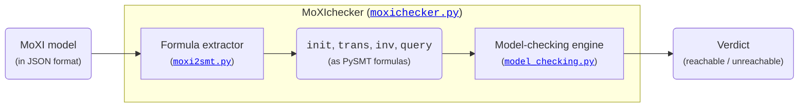

# MoXIchecker: An Extensible Model Checker for MoXI

MoXIchecker is an extensible model-checking framework for the
intermediate modeling language MoXI (**Mo**del e**X**change **I**nterlingua).
The tool is written in Python and can easily incorporate new model-checking algorithms.
Currently, it supports theories of `QF_BV`, `QF_ABV`, `QF_LIA`, `QF_NIA`, `QF_LRA`, and `QF_NRA`.

## System Architecture



## Setup

MoXIchecker relies on Python 3.10 (or newer)
and uses [PySMT](http://www.pysmt.org/) for manipulating and solving SMT formulas.
We recommend [MathSAT](http://mathsat.fbk.eu/) and [Z3](https://github.com/Z3Prover/z3/) as the backend SMT solvers,
as they work best from our experience.

To setup the environment to execute MoXIchecker, run the following commands:

```bash
pip install pysmt==0.9.6
pysmt-install --msat --z3
```

## Usage

To verify whether the query (defined in `check-system`)
is reachable in the system (defined in `define-system`)
of a MoXI model (in JSON format), run:

```bash
./bin/moxichecker <moxi-json-file> # e.g., examples/QF_ABV/count2.moxi.json
```

Please refer to `./bin/moxichecker -h` for more information.

## Contributors

- [Salih Ates](https://gitlab.com/atessalih)
- [Dirk Beyer](https://www.sosy-lab.org/people/beyer/)
- [Po-Chun Chien](https://www.sosy-lab.org/people/chien/)
- [Nian-Ze Lee](https://www.sosy-lab.org/people/lee/)

## License

MoXIchecker is licensed under the [Apache License 2.0](LICENSE).
